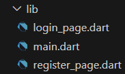
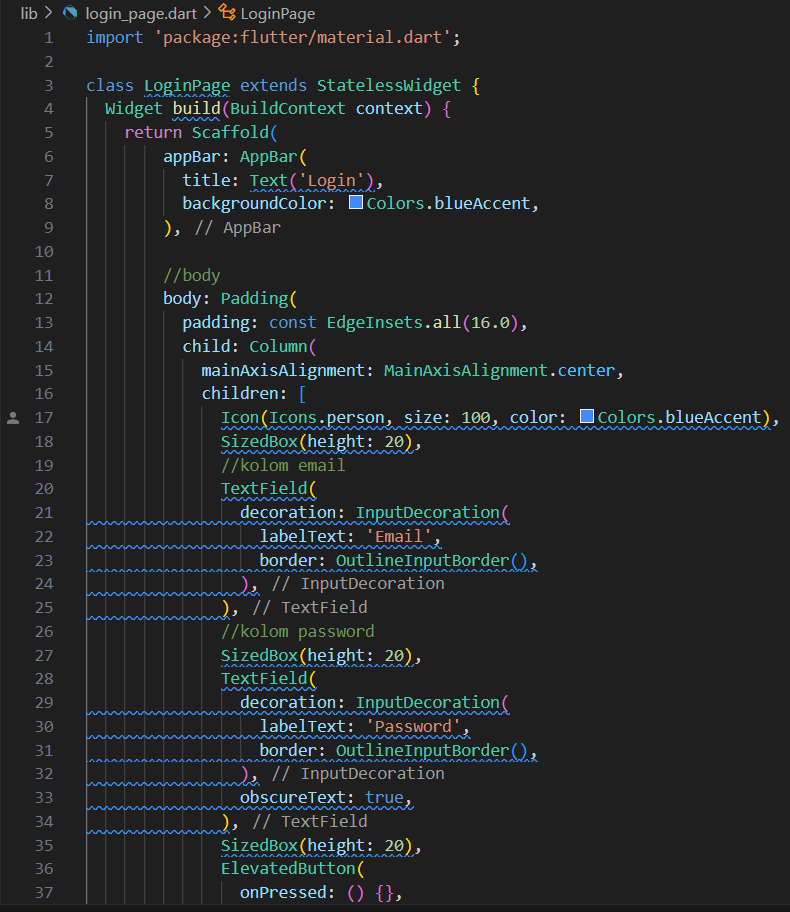
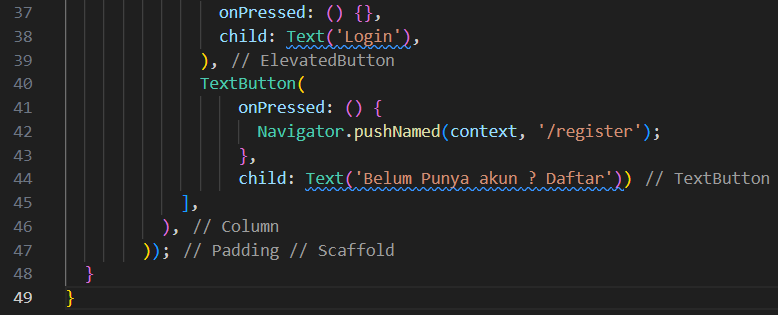
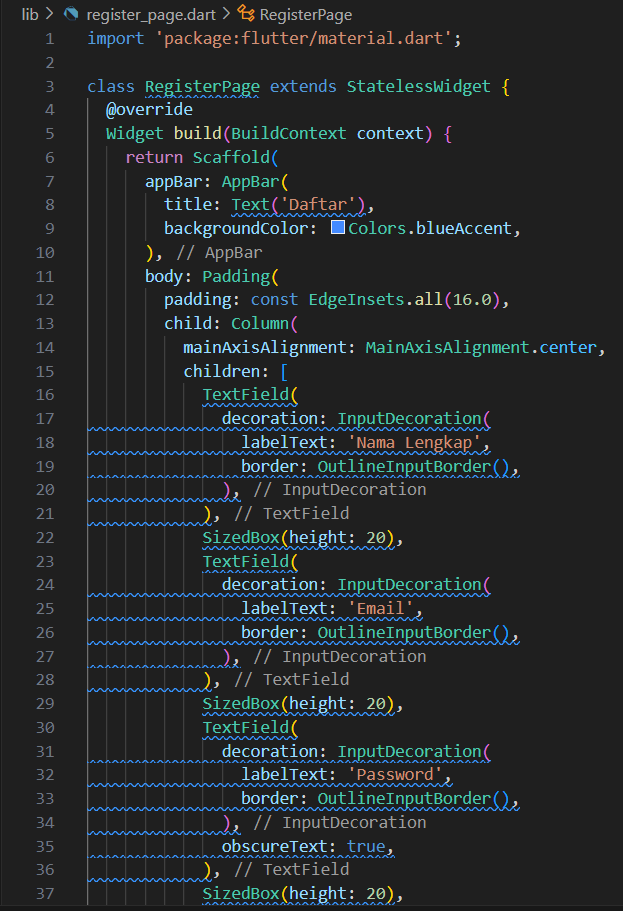
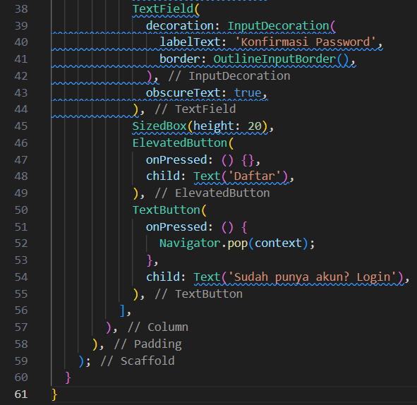
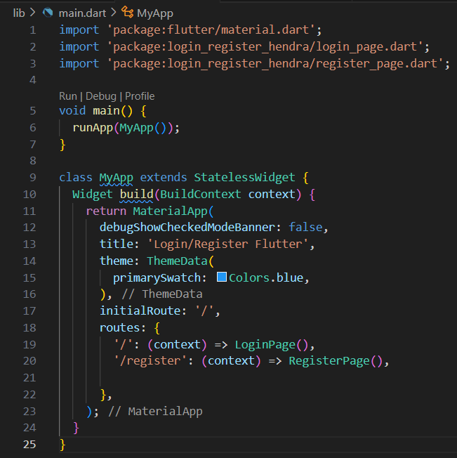
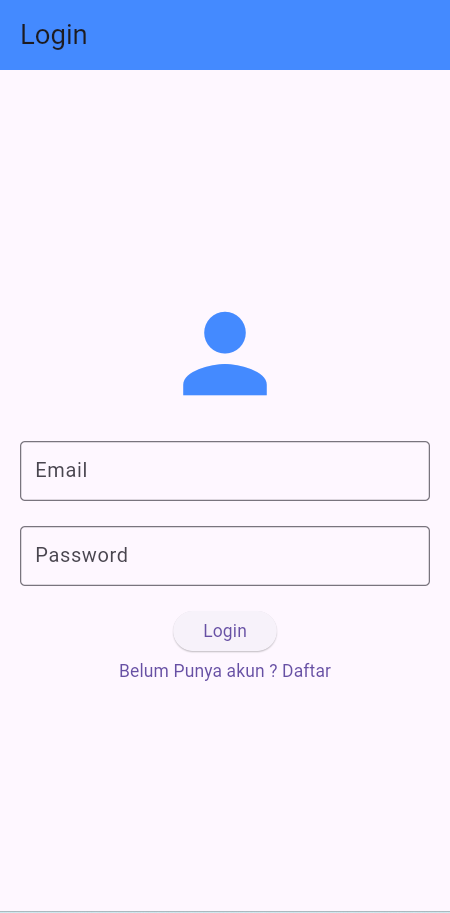
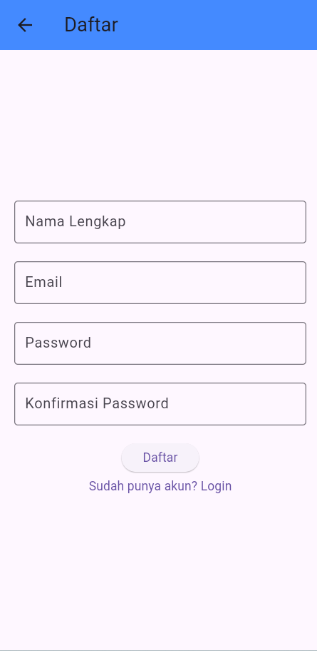

1. Membuat file "login_page.dart" dan "register_page.dart" di dalam folder lib

2. Sintaks dari file "login_page.dart", "register_page.dart", dan "main.dart"

"login_page.dart"

"register_page.dart"

"main.dart"

3. Hasil akhir dari project yang kita buat akan menampilkan seperti berikut

Halaman Login

Halaman Register

